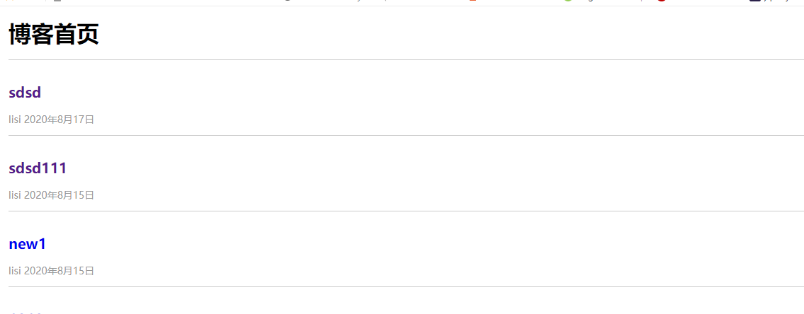
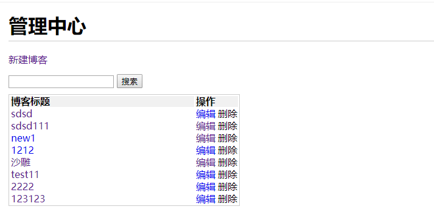
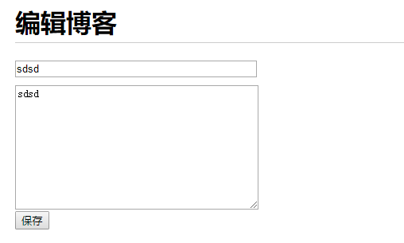
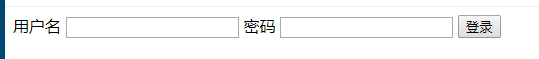

# node_blog
nodejs、express、koa2、pm2、redis、mysql 搭建一个博客 具有增删改查功能

## 展示图片

## 运行

1.运行nginx mysql

2.打开http-test运行 http-server -p 8001

3.打开blog-koa2或blog-express或blog-1运行 npm run dev

4.打开浏览器访问nginx代理地址 localhost:8080
